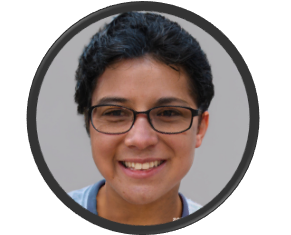

# Especificações do Projeto

A definição exata do problema e os pontos mais relevantes a serem tratados neste projeto foram consolidados com a participação dos usuários em um trabalho de imersão feito pelos membros da equipe a partir da observação dos usuários em seu local natural e por meio de entrevistas. Os detalhes levantados nesse processo foram consolidados na forma de personas e histórias de usuários.

Apresenta-se também os requisitos funcionais e não funcionais, além das restrições do projeto.

## Personas

Desta forma, constatou-se que o presente projeto possui 3 principais personas:

- Vestibulandos (na faixa de idade entre 15 e 18 anos).
- Universitários (na faixa de idade entre 19 e 30 anos )
- Candidatos às vagas de concursos públicos (na faixa de idade de 31 e 50 anos)

A seguir, passamos à análise detalhada das principais personas e suas respectivas histórias de usuários.

| Enzo de Góis                                                                                                                                                                        |                                                                                                                                                                                                                                                    |                                                                                                                                        |
|-------------------------------------------------------------------------------------------------------------------------------------------------------------------------------------|----------------------------------------------------------------------------------------------------------------------------------------------------------------------------------------------------------------------------------------------------|----------------------------------------------------------------------------------------------------------------------------------------|
|                                                                                                                                                              | **Idade:** 16  anos - **Ocupação:** Estudante do Ensino Médio Fundamental e vestibulando.                                                                                                                                                          | **Aplicativos**: Instagram,TikTok, Aplicativos de jogos.                                                                                   |
| **Motivações:**  Enzo está cursando o primeiro grau do ensino médio e já se prepara para a prova de vestibular, com foco em odontologia. ...................................... | **Frustrações:** Além das matérias regulares da escola, Enzo estuda em um cursinho preparatório. As vezes tem dificuldades para conciliar os estudos da escola e as atividades do cursinho preparatório, que inclui treino para a prova do Enem.   | **Hobbies, História:** Enzo, adora tecnologia e utilizar aplicativos inovadores. Nas horas vagas, gosta de jogar online com os amigos. | 

| Pedro Maia                                                                                                                               |                                                                                                                                                                                                                                                                                                                               |                                                                                                                                                                                                                                                                           |
|------------------------------------------------------------------------------------------------------------------------------------------|-------------------------------------------------------------------------------------------------------------------------------------------------------------------------------------------------------------------------------------------------------------------------------------------------------------------------------|---------------------------------------------------------------------------------------------------------------------------------------------------------------------------------------------------------------------------------------------------------------------------|
|                           | **Idade:** 19  anos - **Ocupação:** Estudante de Medicina.                                                                                                                                                                                                                                                                    | **Aplicativos**: Instagram, Facebook, Linkedin, Aplicativos de bancos e Tinder.                                                                                                                                                                                           |
| **Motivações:**  Pedro sonha em ser médico e poder proporcionar uma vida confortável para seus pais. ................................... | **Frustrações:** Pedro estuda em tempo integral e possui muitas matérias para estudar diariamente. A faculdade demanda muita organização e ele possui dificuldades para administrar o tempo de estudos. O cansaço tem contribuído para perda de foco e queda de sua produtividade. Possui TDHA e perde o foco com frequência. | **Hobbies, História:** Pedro acredita que os estudos podem transformar a vida de qualquer pessoa. Está ansioso para concluir o curso e alcançar sua independência profissional e financeira. Nas horas vagas, gosta de visitar lugares novos, como restaurantes e boates. |
|                                                                                                                                          |                                                                                                                                                                                                                                                                                                                               |                                                                                                                                                                                                                                                                           |

| Isabela Meireles                                                                                                |                                                                                                                                                                                                                                                                           |                                                                                                                                                                                                                                                                              |
|-----------------------------------------------------------------------------------------------------------------|---------------------------------------------------------------------------------------------------------------------------------------------------------------------------------------------------------------------------------------------------------------------------|------------------------------------------------------------------------------------------------------------------------------------------------------------------------------------------------------------------------------------------------------------------------------|
|  | **Idade:** 26  anos - **Ocupação:** Analista oficial do TRT.                                                                                                                                                                                                              | **Aplicativos**: Instagram, Linkedin, Aplicativos de bancos.                                                                                                                                                                                                                 |
| **Motivações:** Ser Promotora de Justiça. ................................................................      | **Frustrações:** Além de trabalhar como oficial de justiça no tribunal regional do trabalho, Isabela estuda para um concurso muito disputado e difícil. Possui apenas 4 horas por dia para se dedicar aos estudos e precisa utilizar esse tempo com eficácia e qualidade. | **Hobbies, História:** Isabela passou em seu primeiro concurso aos 21 anos, para o cargo de analista oficial. Contudo, seu grande sonho é ser Promotora de Justiça e por isso se formou em direito. Seu principal hobbe é assistir séries e filmes de investigação criminal. | 

## Histórias de Usuários

Com base na análise das personas forma identificadas as seguintes histórias de usuários:

| EU COMO... `PERSONA` | QUERO/PRECISO ... `FUNCIONALIDADE`                                                      | PARA ... `MOTIVO/VALOR`          |
|----------------------|-----------------------------------------------------------------------------------------|----------------------------------|
| Vestibulando         | Aprender todas as matérias e concluir as tarefas escolares em tempo hábil.              | Passar no vestibular.            |
| Universitário        | Estudar com mais produtividade e foco.                                                  | Aprovação nas matérias do curso. |
| Concurseira          | Concluir cronograma semanal de estudos e aproveitar o tempo disponível de forma eficaz. | Aprovação em concurso público.   |

## Requisitos do projeto

O escopo funcional do projeto abrange duas principais partes: 

1. Requisitos Funcionais: descrevem as  possibilidades  de interação  dos  usuários, 
2. Requisitos  não  funcionais: descrevem os aspectos que o sistema deverá apresentar de maneira geral. 

Estes requisitos são apresentados a seguir, acompanhados por algumas limitações identificadas. Tais informações foram dispostas em tabelas para uma melhor compreensão.

### Requisitos funcionais

| ID  | Descrição                                                                                                                                                                                                               | Prioridade |
| ------------- |-------------------------------------------------------------------------------------------------------------------------------------------------------------------------------------------------------------------------| ------------- |
| RF-01 | O software deve apresentar na tela inicial, o progresso em horas, os projetos ou tarefas criados, ícone para acesso às listas to-do, ícone para acesso e criação de anotações e um botão para adicionar novos projetos. | Alta |
| RF-02 | O cronômetro vem ajustado para 25 minutos de atividade e 5 de pausa.                                                                                                                                                    | Média |
| RF-03 | O software terá uma lista to-do para marcação de tarefas realizadas.                                                                                                                                                    | Alta |
| RF-04 | O software deve conter alternância de tema de acordo com modo diurno e nortuno.                                                                                                                                         | Média |
| RF-05 | O software deve conter status de progresso basedo em parâmetros.                                                                                                                                                        | Média |
| RF-06 | O software deve conter status de progresso em horas referente a cada tarefa.                                                                                                                                            | Baixa |
| RF-07 | O software deve conter parâmetros em horas, divididos em "Total Foco", "Total Distração" e "Total Pausa".                                                                                                               | Baixa |
| RF-08 | O software deve conter botão para acesso a um modal para adição de um novo projeto ou tarefa.                                                                                                                           | Alta |
| RF-09 | O software deve dispor de um coutdown para visualização de progresso.                                                                                                                                                   | Média |
| RF-10 | Os elementos da lista to-do são riscados quando concluídos.                                                                                                                                                             | Média |
| RF-11 | Os elementos da lista to-do podem ser associados ao temporizador de tempo, garantindo a troca de atividades.                                                                                                            | Baixa |
| RF-12 | A paleta de cores do software muda automaticamente de acordo com o horário do computador local.                                                                                                                         | Baixa |
| RF-13 | O software deve exibir um alerta ao final de cada ciclo.                                                                                                                                                                | Média |
| RF-14 | A tela inicial deve exibir menu para interação com outras funcionalidades.                                                                                                                                              | Média |
| RF-15 | O software deve apresentar dentro de cada tarefa ou projeto um temporizador.                                                                                                                                            | Média |
| RF-16 | O software deve conter botão para acesso a um modal, onde o usuário poderá escrever anotações, tal como um bloco de notas.                                                                                              | Baixa |

### Requisitos não-funcionais

| ID  | Descrição | Prioridade |
| ------------- | ------------- | ------------- |
| RNF-01 | A aplicação deve ser publicada em repositório público acessível na internet. | Alta |
| RNF-02 | Uso de design responsivo nas interfaces gráficas.  | Alta |
| RNF-03 | O som do temporizador deve variar de acordo com as configurações do dispositivo. | Baixa |
| RNF-04 | Será possível o ajuste de tempo das terefas ou projetos conforme a necessidade do usuário. | Média |
| RNF-05 | O software deverá armazenar as informações descritas ou selecionas pelo usuário. | Média |

## Restrições

| ID  | Descrição |
| ------------- | ------------- |
| RE-01 | O projeto necessita ser entregue até 07/12/2022, respeitando o prazo estipulado. |
| RE-02 | O projeto deve ser implementado com uso de tecnologias mobile, podendo fazer uso de bibliotecas que influenciem positivamente na qualidade do software.  |

## Diagrama de Casos de Uso

Na Linguagem de modelagem unificada (UML), o objetivo do diagrama de caso de uso é demonstrar as diferentes maneiras que o usuário pode interagir com um sistema.

Dessa forma os alunos podem interagir com o sistema utiliozando os seguintes passos:

# Matriz de Rastreabilidade

A matriz de rastreabilidade é uma ferramenta usada para facilitar a visualização dos relacionamento entre requisitos e outros artefatos ou objetos, permitindo uma visão ampla do escopo do projeto.

## Como ler o diagrama:

- Em "X" estão os requisitos funcionais que se adequam as queixas que os usuarios aprensentam.
- O colorido mostra as relações entre os requisitos e dependencia entre eles.
 

# Gerenciamento de Projeto

De acordo com o PMBoK v6, há 10 áreas pilares para gerenciar projetos e que caracterizam a multidisciplinaridade envolvida: Integração, Escopo, Cronograma (Tempo), Custos, Qualidade, Recursos, Comunicações, Riscos, Aquisições e Partes Interessadas. 

Para o desenvolvimento de projetos, é necessário considerar a gerência de todas essas áreas. Como tais áreas se complementam e estão diretamente relacionadas, não é possível examinar apenas uma área. Por exemplo, a ampliação do escopo de um projeto interfere também em seu cronograma e em seus custos. 

Para realizar esta etapa, a equipe utilizou o [ProjectLibre](https://www.projectlibre.com/), conforme sugerido nas aulas de Gerência de Projetos de TI. 
Desta forma, a equipe registrou as etapas 1 e 2 do projeto, com suas respectivas datas e requisitos, gerando assim, o gráfico de Gantt e o diagrama de rede, automaticamente. Também foi possível identificar as atividades concorrentes,  o caminho crítico, dentre outros elementos.
A equipe pode visualizar as tarefas que devem ser realizadas, organizando-as em hierarquia.

## Gerenciamento de tempo

O gráfico de Gantt, ou diagrama de Gantt, é uma ferramenta visual utilizada para controlar e gerenciar o cronograma de atividades de um projeto. Com ele, é possível listar tudo que precisa ser feito para colocar o projeto em prática, dividir em atividades e estimar o tempo necessário para executá-las. 

No momento, o diagrama mostra o planejamento mais geral das entregas de cada etapa, sendo que as tarefas específicas e seus responsáveis são definidos a cada sprint e gerenciados no [Microsoft Planner: "Projeto TimeUp - Pomodoro"](https://tasks.office.com/sgapucminasbr.onmicrosoft.com/pt-BR/Home/Planner/#/plantaskboard?groupId=ca2f5986-86cc-4dbf-9c21-b586a491ced9&planId=h_Q9NmwXaUijvknhEUY8bWQAEcmA).

O [Microsoft Planner: ](https://tasks.office.com/sgapucminasbr.onmicrosoft.com/pt-BR/Home/Planner/#/plantaskboard?groupId=ca2f5986-86cc-4dbf-9c21-b586a491ced9&planId=h_Q9NmwXaUijvknhEUY8bWQAEcmA) é um aplicativo de planejamento disponível na plataforma Microsoft 365, sendo uma ferramenta orientada para o trabalho em equipe que pode ser usada de várias maneiras. Desta forma, o projeto está organizado pelo método Kanban, possibilitando a visualização geral das atividades, o acompanhamento da evolução dos requisitos e o controle de tempo.

## Gerenciamento de pessoal

O gerenciamento adequado de tarefas permite que o projeto alcance altos níveis de produtividade. Por isso, é fundamental que ocorra a gestão de tarefas e de pessoas, de modo que os times envolvidos no projeto possam ser facilmente gerenciados. 

Conforme mencionado no item anterior, o [Microsoft Planner](https://tasks.office.com/sgapucminasbr.onmicrosoft.com/pt-BR/Home/Planner/#/plantaskboard?groupId=ca2f5986-86cc-4dbf-9c21-b586a491ced9&planId=h_Q9NmwXaUijvknhEUY8bWQAEcmA) apresenta o detalhamento de cada sprint:

No Microsoft Planner, as tarefas podem também ser rastreadas por status, bucket, prioridade e responsável, bem como seu estado de execução:

## Gerenciamento financeiro 

O gerenciamento financeiro permite a todos integrantes do projeto uma ideia inicial de gastos e investimentos, sendo assim não atigindo investidores de forma inesperada e mantendo a ideia de gasto inicial do projeto.

