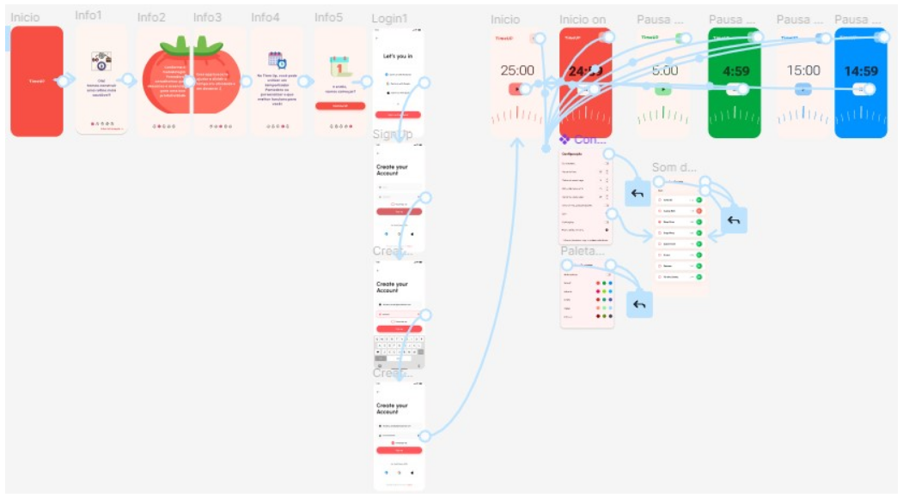
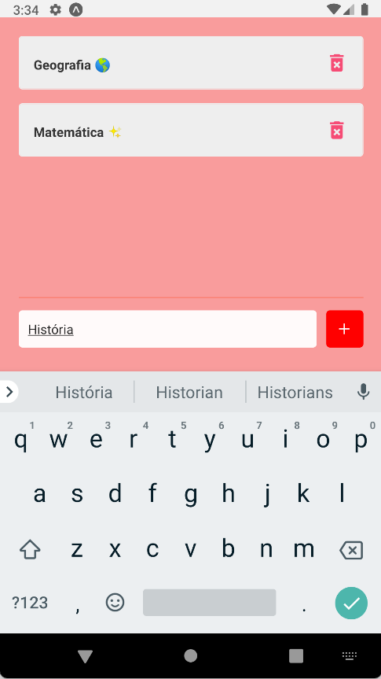
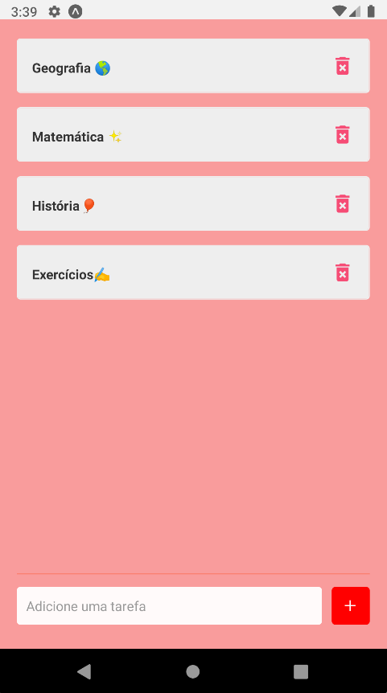
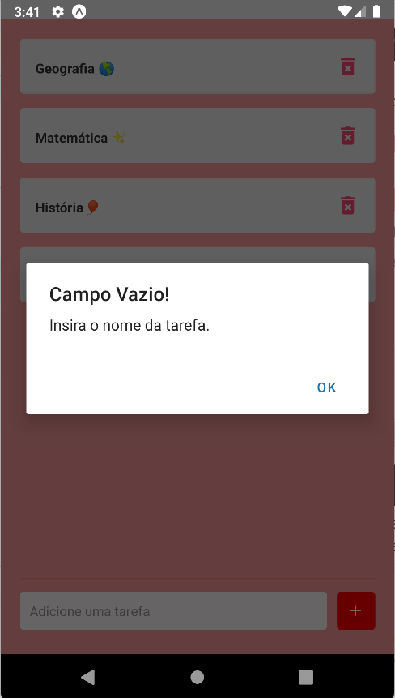

# Arquitetura da Solução

Nesta seção, apresentaremos os detalhes técnicos da solução criada pela equipe, tratando dos componentes que fazem parte da solução e do seu ambiente de hospedagem.

## Diagrama de Classes

O diagrama de classes a seguir ilustra graficamente como será a estrutura do software, e como cada uma das classes da sua estrutura estarão interligadas. Essas classes servem de modelo para materializar os objetos que executarão na memória.

## Processos e suas Respectivas Atividades

Nesta sessão, apresentaremos os modelos de gestão do projeto: BPMN, Tabelas, Gráficos ou Dashboards com no mínimo 5 indicadores de desempenho e metas para o processo de negócio e para o processo de desenvolvimento.

Com auxílio das aulas de Modelagem e Gestão de Processos e Negócios, o grupo determinou como método de gestão de processos, o modelo “**Ciclo BPM**”.

É importante destacar a abordagem de que processo é um trabalho ponta a ponta que atravessa a empresa de maneira transversal ou horizontal para criar valor para o cliente. Para Silva (2017, p. 49): “*Processos ponta a ponta são processos que nascem da necessidade do cliente, passam por várias áreas e departamentos, e terminam na entrega do produto ou serviço para o cliente*”.

Assim, o grupo pretende diminuir a complexidade, fazer o projeto da forma mais ágil e com menos recursos.

Para reforçar o comprometimento com o gerenciamento dos processos, iremos realizar um ciclo contínuo, incluindo as seguintes atividades:

1. **Planejamento** = Início do ciclo; orientação estratégica da organização. Quais serão os processos que atenderão esses preceitos da estratégia: detalhamento.
2. **Análise** = compreender as atividades do processos e os resultados que serão entregues. A organização tem condições de realizar? Quais as dificuldades? A análise é realizada por meio de algumas técnicas, com modelagens, entrevistas com a pessoas envolvidas, simulações, etc. Aqui, ainda não se objetiva encontrar soluções, mas apenas analisar eventuais problemas que podem ocorrer. O processo como ele é.
3. **Desenho** = preocupar com as mudanças necessárias do processo que impactarão o alcance das metas e das organizações, visando a satisfação do cliente. Valor do produto que será entregue. O desing (desenho) indica algo futuro. Que deverá ser executado. Como o processo será, já incorporadas as melhores detectadas na fase de Análise (To-be)? Em que momento será implementados os recursos de tecnologias e os responsáveis do processos. Metas e indicadores e como serão suas implementações, como serão executados.
4. **Implementação** = novo as-is. Nessa fase, modelagem, automação, rp, rm, a implementação irá envolver a programação dessas ferramentas. Preparação das bases de dados, etc. Ao seu final, espera-se o processo em execução (automatizado ou manual, ou híbridos)
5. **Monitoriamento e Controle** = a execução do processo será acompanhada. Não só observar, mas é necessário também agir no sentido de controlar as interferências: medições, comparações, indicadores, *Dashboards*, mapas, cartões, etc. Tudo isso para garantir o alinhamento com a estratégia estabelecidas pelo grupo.
6. **Refinamento** = Os ajustes, aperfeiçoar a implementação. Por mais que bem planejado, o processo muitas vezes necessita de refinamentos. O refinamento fecha o ciclo BPM de gerenciamento de processos de negócios.

A imagem abaixo demonstra o monotoriamento e controle dos 6 elementos, gerados através de dados, registrados pelos membros, de suas respectivas atividades:

Figura Dashboard para Controle de desempenho

### Modelo e Notação de Processos de Negócio
O modelo *Business Process Model and Notation* (BPMN ou em português Modelo e Notação de Processos de Negócio), foi utilizada para descrever o processo de metodologia adotado para o processo de desenvolvimento e para o processo de negócios. Por ser padronizada, a notação BPMN facilitará o entendimento das pessoas envolvidas no projeto.
Neste sentido, com o modelo BPMN, utilizaremos o seu conjunto de elementos gráficos para representar aquelas atividades de trabalho, agrupadas em processos, para indicar como eles serão executados.

Figura Processo de Negócios

Da mesma forma, construímos a modelagem do processo de negócios, facilitando a visão e valorização do cliente.

Figura Processo de Desenvolvimento

### Metas e Indicadores

A BPMN utiliza o seu conjunto de elementos gráficos para representar aquelas atividades de trabalho, agrupadas em processos, para indicar como eles são executados:

Diante disso, o grupo estabeleceu as seguintes metas e indicadores nesse processo de desenvolvimento:

1. Separar regras de negócio das aplicações - **visibilidade e processos mais inteligentes**.
2. Automatizar as regras - **Consistência**
3. Gerenciar um repositório de regras - **Regras como ativos**.
4. Expressar regras de negócio em termos que as pessoas de negócio compreendam - **Visibilidade dos modelos de decisão**
5. Estimular a colaboração entre pessoas de negócio e TI - **Agilidade**

Como meta de negócio, sabe-se que o cliente utilizará o produto com o fim de otimizar o tempo.
Não faz sentido, portanto, que ele gaste muito tempo configurando o serviço. Assim, o grupo estabeleceu que o procedimento de instalar, logar, ver tutorial de uso, determinar tempo e alarme, não deverão ultrapassar 10 minutos.

O objetivo é criar um produto simples e rápido, onde o tempo de instalação e configurações de uso fiquem dentro da margem de aceite (MA) estabelecida pela meta.

| Evento                    | Descrição                                                        | Meta       | Margem de Aceite (MA) |
|---------------------------|------------------------------------------------------------------|------------|-----------------------|
| Instalação                | Período entre a compra do produto até a completa instalação (**) | 5 minutos  | 3 minutos             |
| Configuração              | Acesso ao app, configuração de conta e configuraçoes de uso      | 5 minutoss | 3 minutos             |
| Instalação e Configuração | até 10 minutos                                                   | 10 minutos | 3 minutos             |

| Classificação  de Indicadores | Métrica      |
| ------------- |--------------|
| Viável  | Dentro da Meta |
| Aceitável  | Meta + MA |
| Inviável  | Acima de Meta + MA |

Para alcançar as metas, o grupo utilizará o método **_SMART_**, estabelecendo-se 5 indicadores de desempenho:

1. **Specific/Específico** = Projeto completo até a data 07/12/2022. Utilização do aplicativo em 10 minutos pelo usuário.

2. **Measurable/Mensurável** = em quanto tempo o resultado deve sr alcançado? Em 3 meses

3. **Attainable/Atingível** = considerando a capacidade produtiva dos membros do grupo, é viável a construção de um pomodoro cuja utilização e configuração para uso, não ultrapasse 10 minutos até a data final da conclusão do projeto.

4. **Relevante/Relevant** = a meta é importante pois o serviço está relacionado à administração de tempo e produtividade. Caso o produto atrase o usuário em seus estudos ou tarefas, o produto torna-se completamente inútil. É importante que os membros estabeleçam funcionalidades simples e de fácil usuabilidade para que o principal objetivo do cliente seja atingido: não disperdiçar tempo.

5. **Time Base** = Os membros do grupo deverão ser consultado sobre os prazos de cada etapa do processo, de modo que o cronograma seja definido de forma conjunta entre todos os envolvidos. Cada atividade deverá constar o nome do responsável e data de conclusão.

As ediquetas SMART são definidas no momento em que as atividades são criadas e distribúidas no backlog:

A figura a seguir mostra uma visão geral e atual do método SMART no backlog do projeto:

Figura Indicadores SMART

Para acompanhar o custo e a dificuldade de cada atividade desenvolvida no projeto, foi criado também 3 indicadores de medida: Difícil, Média e Fácil.

Figura Indicadores de Dificuldade

Assim, é possível visualizar as tarefas que irão requerer maior atenção e maior gasto de tempo, servindo inclusive de parâmetro para futuras medições ou atualizações de processos existêntes. Outra vantagem, é a possibilidade de se visualizar possível excesso ao atribuir tarefas à um determinado membro, de modo a distribuir as atividades de forma mais justa e eficiênte de acordo com o grau de dificuldade, sem sobrecarregar os integrantes.

### Quadro Visual Atual de Gestão de Trabalho
Conforme estabelecido na "Figura Processo de Desenvolvimento", após cada integrante chamar uma atividade, ele realizará também o registro do andamento e os indicadores já demonstrados.
A figura a seguir, demonstra o atual quadro de divisão de tarefas, conforme a segunda etapa do projeto. O acompanhamento dinâmico desse quadro, pode ser acessado em nosso Planner [aqui](https://tasks.office.com/sgapucminasbr.onmicrosoft.com/pt-BR/Home/Planner/#/plantaskboard?groupId=ca2f5986-86cc-4dbf-9c21-b586a491ced9&planId=h_Q9NmwXaUijvknhEUY8bWQAEcmA).

Na mesma ferramenta, podemos ainda visualizar o  gráfico geral do controle de desempenho dos integrantes:

Figura Gráfico de desempenho

## Modelo ER

O Modelo ER representa através de um diagrama como as entidades (coisas, objetos) se relacionam entre si na aplicação interativa.]

As referências abaixo irão auxiliá-lo na geração do artefato “Modelo ER”.

## Esquema Relacional

O Modelo ER representa através de um diagrama como as entidades (coisas, objetos) se relacionam entre si na aplicação interativa. Segue abaixo a representação do Modelo ER:

## Tecnologias Utilizadas

-	Linguagens utlizadas para desenvolver o projeto: HTML, CSS, JAVASCRIPT
-	FrameWork utlizado para desenvolver o projeto: React Native
-	IDEs de desenvolvimento: Visual Studio Code
- Plataforma para hospedagem do site: Heroku
- Plataforma para hospedagem dos arquivos: GitHub
- Ferramenta para crição de template: Figma
- Ferramenta para organização do grupo: Planner
- Ferramenta para reuniões do grupo: Microsof Teams

## Hospedagem

Explique como a hospedagem e o lançamento da plataforma foi feita.

> **Links Úteis**:
>
> - [Website com GitHub Pages](https://pages.github.com/)
> - [Programação colaborativa com Repl.it](https://repl.it/)
> - [Getting Started with Heroku](https://devcenter.heroku.com/start)
> - [Publicando Seu Site No Heroku](http://pythonclub.com.br/publicando-seu-hello-world-no-heroku.html)
